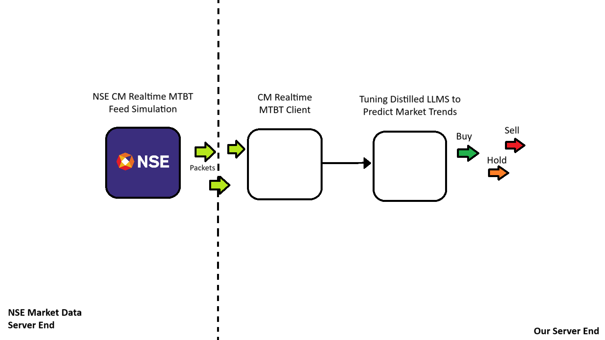

# NSE CM MTBT Feed Analysis using Feed Simuation and LLMs to predict market trends 
This repo consists of my effort on making a simulation of the NSE MTBT CM Feed by simulating an NSE Market Data Server sending the feed and an application that has the client to capture the feed and then efficiently handle it as well has use LLMs to predict the trend and choose whether to sell buy or hold.

## Summary: 
Simulate the NSE CM Realtime MTBT Feed, capture the feed, analyze trends using LLMs and automate buy, sell or hold orders.

Aim: To improve my skills in 
- Low-latency, High performance programming
- Lock free processing
- Parallelism and Concurrency (Multithreading)
- Clean Code
- Usage of GenAI / LLMs/ Prompt Engineering
- Capital  Markets Domain Knowledge
- Memory Safety

I will be mentioning what I do for each of the skill points mentioned above.

## Basic Architecture:

Progress:
### 1. CM MTBT (Capital Markets: Multicast Tick By Tick) Server 
Features and Optimizations:

Logging: For application logging
- Logging class which takes arguements while logging as well
- Logging is of multiple levels: INFO,DEBUG, WARNING, ERROR

Config Parsing: Key value type config file
- Config parser class which takes config file and populates an unordered map with the key and value pairs which are then accessed there and when required.

Scripts: Application dependant BASH scripts
- set_env.sh  - Sets the environment variables as well as navigation aliases for easy navigtion through the application directories
- startup.sh  - To launch the application (TODO)
- shutdown.sh - To shutdown the application (TODO)
- monitor.sh  - To monitor the application and feed status (TODO)

Server End Data Simulation: 
- Statistically most of the orders are order cancellations (55%), order modifications (35%) and the least are new orders (10%) so the orders are simulated with this probability in mind 
- 50% of the trades are buy and 50% are sell trades
- Uniform distributions are used for various simulations for both order and trade messages
- Pump actual data from the server to get more accurate and realworld results. a). Get an old UDP dump file from NSE Data Analytics b). Repurpose available sample csv files from historical data or similar products to create a UDP dump that can be played (TODO)

Server End Optimizations
- CPU Isolation: Binded the mainthread to Core 2 of the CPU to 
a) Avoid Cache Misses b) To avoid switching of cores : which leads to better performance
- Multithreading was not used since the latency for populating and sending the messages on multicast took less than 1ms per packet.
- S0_SNDBUF size was increased to handle drops due to packet bursts.
- Cache data so the cost for retrieve all the values everytime when it is required is low (TODO)
- Fcntl non-blocking enabled to disable socket being interuppted by the system
- Used const in parameters and wherever required to indicate values that don't change so letting the compiler go ahead and rigorously optimize it.
- Avoided logs in the hot paths to decrease the load due to them and the latency they add.
- Reuse of structure and class instances instead of declaring one everytime to avoid memory leaks.

### Core Goals of Low-Latency in C++
- Kernel Bypass to access NIC directly and reduce Kernel induced copy and parsing - usnig DPDK (TODO)
- Zero Copy Parsing to directly parse packets without using memcpy(TODO)
- Use lock Free Queues and atomic instead of mutexes (Boost Library) 
- Maximize Cache locality and CPU pridictability - Bind threads to core and set thread priority (DONE)
- Use compile time polymorphism (static binding) and void runtime polymorphismm (DONE) - This reduces latency during runtime.
- Branchless coding and avoiding dynamic memory allocation or logs in hot paths.

